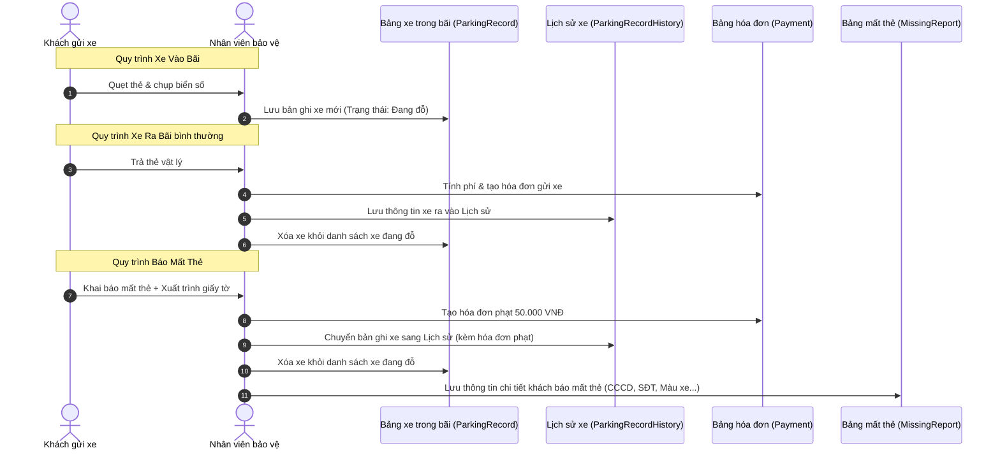

# Tổng Quan Code Backend - Hệ Thống Quản Lý Bãi Xe (Parking Management)

Tài liệu này được biên soạn đặc biệt dành cho bạn — người không chuyên về lập trình — giúp bạn hiểu rõ từng bộ phận, cấu trúc dữ liệu và các quy trình nghiệp vụ cốt lõi trong mã nguồn backend của dự án.

---

## 1. Ẩn Dụ Thực Tế: Hệ Thống Hoạt Động Như Thế Nào?

Để dễ hình dung, hãy tưởng tượng bãi gửi xe thông minh hoạt động như một bến bãi truyền thống có 4 nhân vật chính:

1. **Người Bảo Vệ ở Cổng Vào (Controller)**: Là người đứng ở barie nhận diện khách hàng. Khách đưa biển số xe hoặc mã thẻ, người này sẽ chuyển thông tin cho người ghi chép.
2. **Người Ghi Chép Sổ Sách (Service)**: Là người giữ bộ não của bãi xe. Người này quyết định xem xe này là khách vãng lai hay vé tháng, tính tiền phí gửi xe khi xe ra, phạt tiền khi mất thẻ, v.v.
3. **Thủ Thư Giữ Kho Hồ Sơ (Repository)**: Người chuyên chạy vào kho lục tìm tài liệu cũ hoặc cất tài liệu mới vào ngăn tủ.
4. **Các Ngăn Tủ Hồ Sơ (Database / Entity)**: Nơi lưu các tệp thông tin như: Danh sách xe trong bãi, Danh sách vé tháng, Lịch sử xe đã ra, Báo cáo mất thẻ, v.v.

---

## 2. Bản Đồ Thư Mục Mã Nguồn (Code Directory Map)

Mã nguồn backend được viết bằng ngôn ngữ **Java** kết hợp với khung phát triển **Spring Boot** và kiến trúc chia lớp (Layered Architecture):

* **[entity/](file:///d:/demo_gui_xe/parking-management-backend/src/main/java/com/group1/parking_management/entity)**: Chứa định nghĩa các bảng dữ liệu (những "ngăn tủ" chứa hồ sơ).
* **[repository/](file:///d:/demo_gui_xe/parking-management-backend/src/main/java/com/group1/parking_management/repository)**: Chứa các lệnh truy vấn dữ liệu (lấy thông tin từ cơ sở dữ liệu lên hoặc lưu thông tin mới xuống).
* **[service/](file:///d:/demo_gui_xe/parking-management-backend/src/main/java/com/group1/parking_management/service)**: Khai báo các chức năng/nghiệp vụ hệ thống có (như một menu các dịch vụ).
* **[service/impl/](file:///d:/demo_gui_xe/parking-management-backend/src/main/java/com/group1/parking_management/service/impl)**: Chứa mã nguồn thực tế triển khai các dịch vụ trên (nơi chứa logic tính toán chính).
* **[controller/](file:///d:/demo_gui_xe/parking-management-backend/src/main/java/com/group1/parking_management/controller)**: Các cổng tiếp nhận yêu cầu từ ứng dụng giao diện (Web/Mobile) gửi lên.
* **[dto/](file:///d:/demo_gui_xe/parking-management-backend/src/main/java/com/group1/parking_management/dto)**: Các gói thông tin được định dạng gọn gàng để chuyển đi giữa Giao diện và Backend.

---

## 3. Bản Đồ Dữ Liệu: Ý Nghĩa Các Bảng (Entities)

Dưới đây là các bảng dữ liệu được định nghĩa trong thư mục `entity`:

| Tên Bảng (File Code) | Ý nghĩa thực tế |
| :--- | :--- |
| **[Account.java](file:///d:/demo_gui_xe/parking-management-backend/src/main/java/com/group1/parking_management/entity/Account.java)** | Tài khoản đăng nhập hệ thống (tên đăng nhập, mật khẩu mã hóa, vai trò Admin/Staff). |
| **[Staff.java](file:///d:/demo_gui_xe/parking-management-backend/src/main/java/com/group1/parking_management/entity/Staff.java)** | Thông tin cá nhân nhân viên bảo vệ trực bãi (họ tên, số điện thoại, địa chỉ). |
| **[ParkingCard.java](file:///d:/demo_gui_xe/parking-management-backend/src/main/java/com/group1/parking_management/entity/ParkingCard.java)** | Thông tin về thẻ gửi xe vật lý (mã số thẻ). |
| **[ParkingRecord.java](file:///d:/demo_gui_xe/parking-management-backend/src/main/java/com/group1/parking_management/entity/ParkingRecord.java)** | Danh sách **xe hiện đang đỗ trong bãi**. Ghi nhận thời gian vào, nhân viên cho vào, biển số xe. |
| **[ParkingRecordHistory.java](file:///d:/demo_gui_xe/parking-management-backend/src/main/java/com/group1/parking_management/entity/ParkingRecordHistory.java)** | Lịch sử **xe đã đi ra khỏi bãi**. Lưu đầy đủ giờ vào, giờ ra, nhân viên duyệt ra, số tiền thanh toán. |
| **[ActiveMonthlyRegistration.java](file:///d:/demo_gui_xe/parking-management-backend/src/main/java/com/group1/parking_management/entity/ActiveMonthlyRegistration.java)** | Danh sách đăng ký vé tháng **đang còn hạn sử dụng**. |
| **[ExpireMonthlyRegistration.java](file:///d:/demo_gui_xe/parking-management-backend/src/main/java/com/group1/parking_management/entity/ExpireMonthlyRegistration.java)** | Danh sách đăng ký vé tháng **đã hết hạn sử dụng**. |
| **[Payment.java](file:///d:/demo_gui_xe/parking-management-backend/src/main/java/com/group1/parking_management/entity/Payment.java)** | Hóa đơn thanh toán tiền (lưu số tiền thu được và loại thanh toán: trả vé ngày hay phạt mất thẻ). |
| **[Price.java](file:///d:/demo_gui_xe/parking-management-backend/src/main/java/com/group1/parking_management/entity/Price.java)** | Cấu hình bảng giá của bãi xe (giá ban ngày, giá ban đêm của từng loại xe). |
| **[MissingReport.java](file:///d:/demo_gui_xe/parking-management-backend/src/main/java/com/group1/parking_management/entity/MissingReport.java)** | Báo cáo mất thẻ xe (lưu giữ thông tin chủ xe báo mất để đối chiếu và xử lý phạt thẻ). |

---

## 4. Giải Thích Chi Tiết Từng Dòng Code Các Quy Trình Nghiệp Vụ Chính

Chúng ta sẽ đi sâu vào 3 quy trình quan trọng nhất của bãi xe: **Xe Vào**, **Xe Ra (Tính Phí)**, và **Báo Mất Thẻ**.

---

### Quy Trình 1: Cho Xe Vào Bãi (Check-in)
Nằm tại hàm `registerEntry` trong tệp **[ParkingServiceImpl.java](file:///d:/demo_gui_xe/parking-management-backend/src/main/java/com/group1/parking_management/service/impl/ParkingServiceImpl.java#L70-L115)**.

```java
// Dòng 69: Chỉ cho phép tài khoản có vai trò 'STAFF' (Nhân viên) thực hiện hành động này.
@PreAuthorize("hasRole('STAFF')")
public ParkingEntryResponse registerEntry(ParkingEntryRequest request) {
    
    // Dòng 71-73: Xác định xem nhân viên nào đang thực hiện quẹt thẻ cho xe vào bằng cách lấy tên tài khoản từ phiên đăng nhập.
    String username = SecurityContextHolder.getContext().getAuthentication().getName();
    Account staff = accountRepository.findByUsername(username)
            .orElseThrow(() -> new AppException(ErrorCode.STAFF_NOT_FOUND));

    // Dòng 75-77: Kiểm tra xem thông tin gửi lên từ máy quẹt thẻ có hợp lệ không.
    // Nếu cả biển số xe (license plate) và mã định danh xe đều trống, báo lỗi ngay lập tức.
    if (!StringUtils.hasText(request.getLicensePlate()) && !StringUtils.hasText(request.getIdentifier())) {
        throw new AppException(ErrorCode.PARKING_IDENTIFICATION_ERROR);
    }
    
    // Dòng 78-81: Nếu có biển số xe, kiểm tra xem xe này có đang nằm sẵn trong bãi không. 
    // Tránh trường hợp một xe chưa đi ra đã quẹt thẻ đi vào tiếp (gian lận hoặc lỗi hệ thống).
    if (StringUtils.hasText(request.getLicensePlate())
            && parkingRecordRepository.existsByLicensePlate(request.getLicensePlate())) {
        throw new AppException(ErrorCode.PARKING_LICENSE_PLATE_EXISTED);
    }
    
    // Dòng 82-85: Kiểm tra tương tự đối với mã định danh (nếu xe dùng thẻ định danh/RFID thay vì biển số).
    if (StringUtils.hasText(request.getIdentifier())
            && parkingRecordRepository.existsByIdentifier(request.getIdentifier())) {
        throw new AppException(ErrorCode.PARKING_IDENTIFIER_EXISTED);
    }
    
    // Dòng 87-90: Kiểm tra xem xe này có nằm trong danh sách đen (Blacklist) báo mất thẻ trước đó chưa được giải quyết hay không.
    if (StringUtils.hasText(request.getLicensePlate()) 
            && missingReportRepository.existsByLicensePlate(request.getLicensePlate())) {
        throw new AppException(ErrorCode.VEHICLE_BLACKLISTED);
    }

    // Dòng 92-93: Kiểm tra xem biển số xe này có đăng ký vé tháng và đang hoạt động không.
    // Nếu có, đánh dấu loại vé gửi xe là MONTHLY (vé tháng), ngược lại là DAILY (vé ngày vãng lai).
    boolean hasMonthlyCard = activeMonthlyRegistrationRepository.existsByLicensePlate(request.getLicensePlate());
    ParkingType parkingType = hasMonthlyCard ? ParkingType.MONTHLY : ParkingType.DAILY;

    // Dòng 95-99: Tạo một mã thẻ gửi xe tạm thời dựa theo thời gian thực (giây-phút-giờ-ngày-tháng-năm) và lưu vào bảng thẻ xe.
    String cardId = LocalDateTime.now().format(java.time.format.DateTimeFormatter.ofPattern("ssmmHHddMMyy"));
    ParkingCard parkingCard = new ParkingCard();
    parkingCard.setCardId(cardId);
    parkingCard = parkingCardRepository.save(parkingCard);

    // Dòng 101-102: Lấy thông tin loại xe (Xe máy, Ô tô, Xe đạp) từ mã loại xe gửi kèm yêu cầu.
    VehicleType vehicleType = vehicleTypeRepository.findById(request.getVehicleTypeId())
            .orElseThrow(() -> new AppException(ErrorCode.PARKING_VEHICLE_TYPE_NOT_FOUND));

    // Dòng 104-112: Tạo một phiếu ghi nhận xe vào bãi (ParkingRecord) gồm:
    // Biển số, mã định danh, loại xe, thẻ xe cấp phát, thời gian vào là thời điểm hiện tại, loại vé (ngày/tháng), nhân viên trực cổng vào.
    ParkingRecord parkingRecord = ParkingRecord.builder()
            .licensePlate(request.getLicensePlate())
            .identifier(request.getIdentifier())
            .vehicleType(vehicleType)
            .card(parkingCard)
            .entryTime(LocalDateTime.now())
            .type(parkingType)
            .staffIn(staff)
            .build();

    // Dòng 114: Lưu thông tin xe đang gửi vào cơ sở dữ liệu và trả về kết quả thành công cho giao diện hiển thị.
    return recordMapper.toParkingEntryResponse(parkingRecordRepository.save(parkingRecord));
}
```

---

### Quy Trình 2: Cho Xe Ra Bãi (Check-out) & Tính Tiền
Nằm tại hàm `processExit` và `calculateParkingFee` trong tệp **[ParkingServiceImpl.java](file:///d:/demo_gui_xe/parking-management-backend/src/main/java/com/group1/parking_management/service/impl/ParkingServiceImpl.java#L120-L213)**.

```java
// Dòng 119: Chỉ nhân viên trực (STAFF) mới có quyền quẹt xe ra.
@PreAuthorize("hasRole('STAFF')")
public ParkingExitResponse processExit(ParkingExitRequest request) {
    
    // Dòng 121-123: Lấy thông tin nhân viên trực cổng ra hiện tại.
    String username = SecurityContextHolder.getContext().getAuthentication().getName();
    Account staff = accountRepository.findByUsername(username)
            .orElseThrow(() -> new AppException(ErrorCode.STAFF_NOT_FOUND));

    // Dòng 125-127: Đảm bảo giao diện truyền lên ít nhất biển số xe hoặc mã định danh.
    if (!StringUtils.hasText(request.getLicensePlate()) && !StringUtils.hasText(request.getIdentifier())) {
        throw new AppException(ErrorCode.PARKING_IDENTIFICATION_ERROR);
    }

    String cardId = request.getCardId();

    // Dòng 131-133: Tìm kiếm phiếu xe đang đỗ trong bãi khớp với biển số xe và mã thẻ.
    Optional<ParkingRecord> parkingRecordOpt = StringUtils.hasText(request.getLicensePlate())
            ? parkingRecordRepository.findByLicensePlateAndCard_CardId(request.getLicensePlate(), cardId)
            : parkingRecordRepository.findByIdentifierAndCard_CardId(request.getIdentifier(), cardId);

    // Dòng 135-136: Nếu không tìm thấy xe trong bãi khớp với thẻ này, báo lỗi.
    ParkingRecord parkingRecord = parkingRecordOpt
            .orElseThrow(() -> new AppException(ErrorCode.PARKING_RECORD_NOT_FOUND));

    // Dòng 138: Gọi hàm phụ để tính toán số tiền phí gửi xe cần thu (Giải thích chi tiết thuật toán bên dưới).
    int fee = calculateParkingFee(parkingRecord);

    // Dòng 140-145: Tạo hóa đơn thanh toán phí gửi xe và lưu lại.
    Payment payment = Payment.builder()
            .amount(fee)
            .createAt(LocalDateTime.now())
            .paymentType(PaymentType.PARKING)
            .build();
    paymentRepository.save(payment);

    // Dòng 147-148: Tạo một bản ghi lịch sử, chuyển toàn bộ thông tin (giờ vào, giờ ra, nhân viên cho vào, nhân viên cho ra, hóa đơn tiền).
    ParkingRecordHistory recordHistory = parkingRecordHistoryRepository
            .save(recordToHistory(parkingRecord, payment, staff));

    // Dòng 150: Xóa bản ghi ở bảng "xe đang đỗ trong bãi" (vì xe đã ra ngoài rồi).
    parkingRecordRepository.delete(parkingRecord);

    // Dòng 152: Trả về kết quả xe ra thành công cùng số tiền thu được để hiển thị lên màn hình.
    return recordMapper.toParkingExitResponse(recordHistory);
}
```

#### Thuật toán tính phí gửi xe (`calculateParkingFee`):
1. **Vé tháng (`ParkingType.MONTHLY`)**: Số tiền thanh toán bằng **0đ** (vì khách hàng đã trả tiền thuê bao tháng trước đó).
2. **Vé ngày (`ParkingType.DAILY`)**:
   - Tính tổng thời gian đỗ xe (từ lúc vào đến lúc ra).
   - Nếu đỗ tròn ngày (ví dụ: đỗ 2 ngày): Phí = `số ngày` * `(giá ngày + giá đêm)`.
   - Đối với khoảng thời gian lẻ còn dư ra:
     - So sánh xem mốc thời gian rơi vào khung giờ ngày hay khung giờ đêm (theo cấu hình hệ thống).
     - Áp phí ngày hoặc đêm tương ứng của loại xe đó để cộng dồn vào tổng tiền gửi xe.

---

### Quy Trình 3: Báo Mất Thẻ Xe (Missing Report)
Nằm tại hàm `createMissingReport` trong tệp **[MissingReportServiceImpl.java](file:///d:/demo_gui_xe/parking-management-backend/src/main/java/com/group1/parking_management/service/impl/MissingReportServiceImpl.java#L50-L102)**.

Khi khách báo mất thẻ, quy trình sẽ thực hiện phạt tiền mất thẻ, ghi lại thông tin xác minh của khách để tránh gian lận lấy trộm xe, và cho xe xuất bãi.

```java
// Dòng 49: Chỉ cho phép Nhân viên (STAFF) tạo báo cáo báo mất thẻ.
@PreAuthorize("hasRole('STAFF')")
@Transactional // Đảm bảo nếu một bước bị lỗi thì toàn bộ quá trình sẽ được khôi phục, tránh sai lệch dữ liệu.
public MissingReportResponse createMissingReport(MissingReportRequest request) {
    
    // Dòng 51-53: Lấy thông tin nhân viên đang xử lý báo mất thẻ.
    String username = SecurityContextHolder.getContext().getAuthentication().getName();
    Account staff = accountRepository.findByUsername(username)
            .orElseThrow(() -> new AppException(ErrorCode.STAFF_NOT_FOUND));

    // Dòng 55-64: Tìm xe trong bãi đang đăng ký bằng biển số hoặc định danh này.
    // Vì khách mất thẻ vật lý nên ta phải tìm xe bằng cách gõ biển số xe trực tiếp trên hệ thống.
    ParkingRecord record = null;
    if (!StringUtils.hasText(request.getLicensePlate()) && !StringUtils.hasText(request.getIdentifier())) {
        throw new AppException(ErrorCode.PARKING_IDENTIFICATION_ERROR);
    } else if (StringUtils.hasText(request.getLicensePlate())) {
        record = parkingRecordRepository.findByLicensePlate(request.getLicensePlate())
                .orElseThrow(() -> new AppException(ErrorCode.VEHICLE_NOT_IN_PARKING));
    } else {
        record = parkingRecordRepository.findByIdentifier(request.getIdentifier())
                .orElseThrow(() -> new AppException(ErrorCode.VEHICLE_NOT_IN_PARKING));
    }

    // Dòng 66-71: Kiểm tra chéo loại xe.
    // Ví dụ: Đăng ký lúc vào là xe máy nhưng lúc báo mất thẻ lại khai báo là xe đạp điện thì hệ thống sẽ từ chối để đề phòng trộm cắp.
    VehicleType vehicleType = vehicleTypeRepository.findById(request.getVehicleTypeId())
            .orElseThrow(() -> new AppException(ErrorCode.PARKING_VEHICLE_TYPE_NOT_FOUND));
    if (vehicleType != record.getVehicleType()) {
        throw new AppException(ErrorCode.MONTHLY_VEHICLE_TYPE_NOT_EQUALS_TO_RECORD);
    }

    // Dòng 73-78: Tạo một hóa đơn phạt tiền mất thẻ trị giá 50.000 VNĐ cố định.
    Payment payment = Payment.builder()
            .amount(50000) // 50,000 VND
            .createAt(LocalDateTime.now())
            .paymentType(PaymentType.MISSING) // Đánh dấu thanh toán này là do "mất thẻ"
            .build();
    paymentRepository.save(payment);

    // Dòng 80-82: Đưa xe ra khỏi bãi xe ảo bằng cách chuyển bản ghi xe sang lịch sử (ParkingRecordHistory) gắn kèm hóa đơn phạt, sau đó xóa xe khỏi danh sách xe đang đỗ trong bãi.
    ParkingRecordHistory history = parkingRecordHistoryRepository
            .save(parkingService.recordToHistory(record, payment, staff));
    parkingRecordRepository.delete(record);

    // Dòng 84-98: Lưu lại toàn bộ hồ sơ báo cáo mất thẻ bao gồm:
    // Bản ghi lịch sử xe ra, biển số xe, thông tin cá nhân khách hàng (họ tên, giới tính, số điện thoại, địa chỉ cư trú, thương hiệu xe, màu sắc xe, số CMND/CCCD) để làm bằng chứng pháp lý sau này.
    MissingReport report = MissingReport.builder()
            .record(history)
            .licensePlate(request.getLicensePlate())
            .vehicleType(vehicleType)
            .name(request.getName())
            .gender(request.getGender())
            .phoneNumber(request.getPhoneNumber())
            .address(request.getAddress())
            .brand(request.getBrand())
            .color(request.getColor())
            .identification(request.getIdentification())
            .payment(payment)
            .createBy(staff)
            .createAt(LocalDateTime.now())
            .build();

    // Dòng 100: Lưu báo cáo vào cơ sở dữ liệu và trả kết quả phản hồi về ứng dụng quản lý.
    return missingReportMapper.toReportResponse(missingReportRepository.save(report));
}
```

---

## 5. Tóm Tắt Luồng Dữ Liệu Khi Xe Ra/Vào

Quy trình tuần tự của dữ liệu trong cơ sở dữ liệu:



---

Hy vọng tài liệu này giúp bạn dễ dàng nắm bắt được cách thức vận hành và quản lý của mã nguồn dự án bãi giữ xe! Nếu có dòng mã hoặc nghiệp vụ nào cần giải thích thêm, bạn cứ hỏi tôi nhé.
